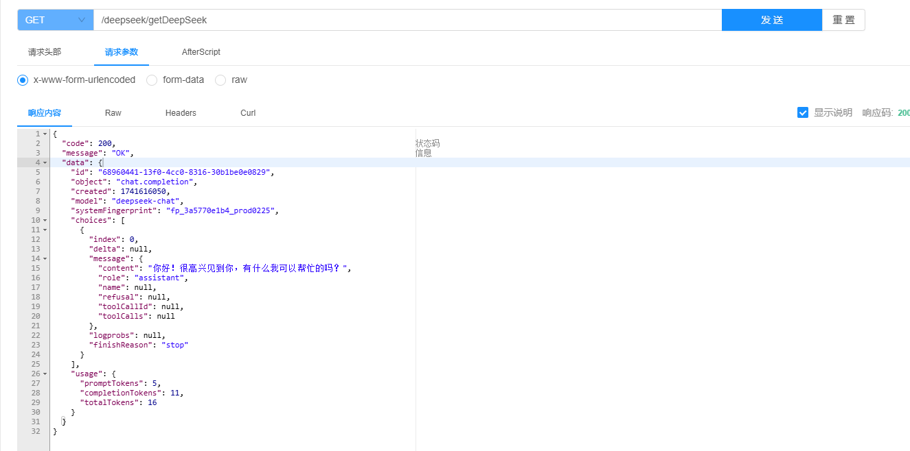

# deepseek-spring-boot-starter

> 官方 api 文档：[https://api-docs.deepseek.com/zh-cn/](https://api-docs.deepseek.com/zh-cn/)
>
> 官方开放平台： [https://platform.deepseek.com/api_keys](https://platform.deepseek.com/api_keys)
>
> 因为官方没有 Java SDK，所以自定义一个 spring-boot 组件方便使用。

## 快速开始

1. 引入 pom

~~~xml

<dependency>
    <groupId>com.mobaijun</groupId>
    <artifactId>deepseek-spring-boot-starter</artifactId>
    <version>${latest-version}</version>
</dependency>
~~~

2. yml 配置 deepseek api key

~~~yml
deepseek:
  api-key: sk-1ee33f08024f40b5b4af9f21957043d4
~~~

3. 编写一个测试类

~~~java
package com.mobaijun.deepseektest.controller;

import com.mobaijun.common.result.R;
import com.mobaijun.deepseek.entity.ChatCompletion;
import com.mobaijun.deepseek.entity.ChatCompletionResponse;
import com.mobaijun.deepseek.entity.ChatMessage;
import com.mobaijun.deepseek.service.DeepSeekChatService;
import io.swagger.v3.oas.annotations.Operation;
import io.swagger.v3.oas.annotations.tags.Tag;
import lombok.RequiredArgsConstructor;
import org.springframework.web.bind.annotation.GetMapping;
import org.springframework.web.bind.annotation.RequestMapping;
import org.springframework.web.bind.annotation.RestController;

/**
 * Description: []
 * Author: [mobaijun]
 * Date: [2025/3/10 21:38]
 * IntelliJ IDEA Version: [IntelliJ IDEA 2023.1.4]
 */
@RestController
@RequiredArgsConstructor
@RequestMapping("/deepseek")
@Tag(name = "测试管理", description = "测试管理")
public class DeepSeekController {

    private final DeepSeekChatService deepSeekChatService;

    @Operation(tags = "测试deepseek")
    @GetMapping("/getDeepSeek")
    public R<ChatCompletionResponse> getDeepSeek() {
        ChatMessage chatMessage = ChatMessage.builder().content("你好啊").role("user").name("mobaijun").build();
        ChatCompletion chatCompletion = ChatCompletion.builder().model("deepseek-chat").message(chatMessage).build();
        return R.ok(deepSeekChatService.chatCompletion(chatCompletion));
    }
}
~~~

## 主要方法

~~~java
package com.mobaijun.deepseek.service;

import com.mobaijun.deepseek.entity.ChatCompletion;
import com.mobaijun.deepseek.entity.ChatCompletionResponse;
import com.mobaijun.deepseek.entity.ModelsInfo;
import com.mobaijun.deepseek.listener.SseListener;

/**
 * Description: [deepseek 业务接口]
 * Author: [mobaijun]
 * Date: [2025/1/16 11:12]
 * IntelliJ IDEA Version: [IntelliJ IDEA 2023.1.4]
 */
public interface DeepSeekChatService {

    /**
     * 执行聊天补全请求，并返回结果。
     *
     * @param baseUrl        服务的基础 URL。
     * @param apiKey         用于身份验证的 API Key。
     * @param chatCompletion 包含聊天补全请求数据的对象。
     * @return ChatCompletionResponse 聊天补全的响应对象。
     */
    ChatCompletionResponse chatCompletion(String baseUrl, String apiKey, ChatCompletion chatCompletion);

    /**
     * 执行聊天补全请求，使用默认的 Base URL 和 API Key。
     *
     * @param chatCompletion 包含聊天补全请求数据的对象。
     * @return ChatCompletionResponse 聊天补全的响应对象。
     */
    ChatCompletionResponse chatCompletion(ChatCompletion chatCompletion);

    /**
     * 执行聊天补全请求，并通过流（SSE）接收实时响应。
     *
     * @param baseUrl             服务的基础 URL。
     * @param apiKey              用于身份验证的 API Key。
     * @param chatCompletion      包含聊天补全请求数据的对象。
     * @param eventSourceListener 监听服务器发送事件（SSE）的回调接口。
     */
    void chatCompletionStream(String baseUrl, String apiKey, ChatCompletion chatCompletion, SseListener eventSourceListener);

    /**
     * 执行聊天补全请求，通过流（SSE）接收实时响应，使用默认的 Base URL 和 API Key。
     *
     * @param chatCompletion      包含聊天补全请求数据的对象。
     * @param eventSourceListener 监听服务器发送事件（SSE）的回调接口。
     */
    void chatCompletionStream(ChatCompletion chatCompletion, SseListener eventSourceListener);

    /**
     * 获取模型列表
     *
     * @param baseUrl 基础url
     * @param apiKey  api key
     * @return 模型列表
     */
    ModelsInfo getModelsInfo(String baseUrl, String apiKey);
}
~~~

